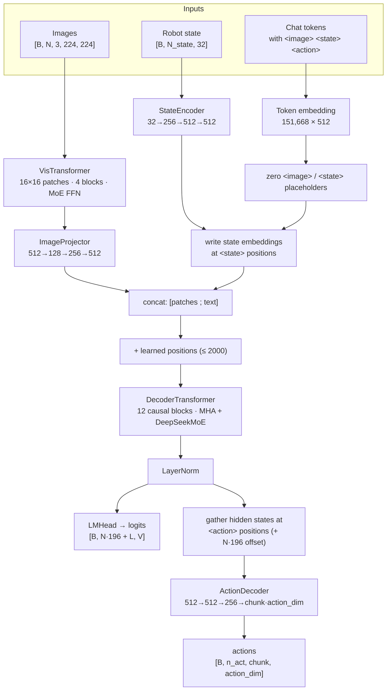
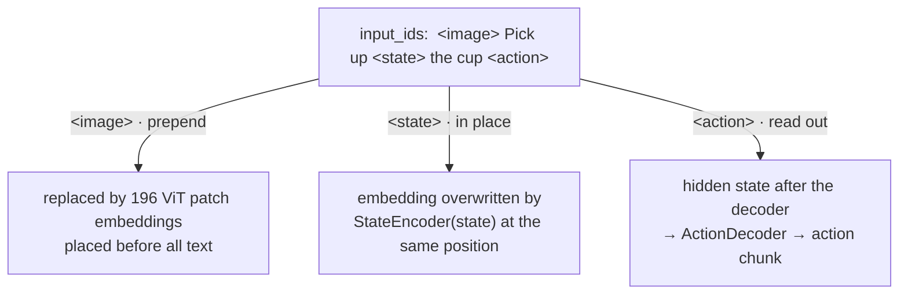
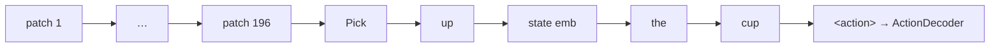
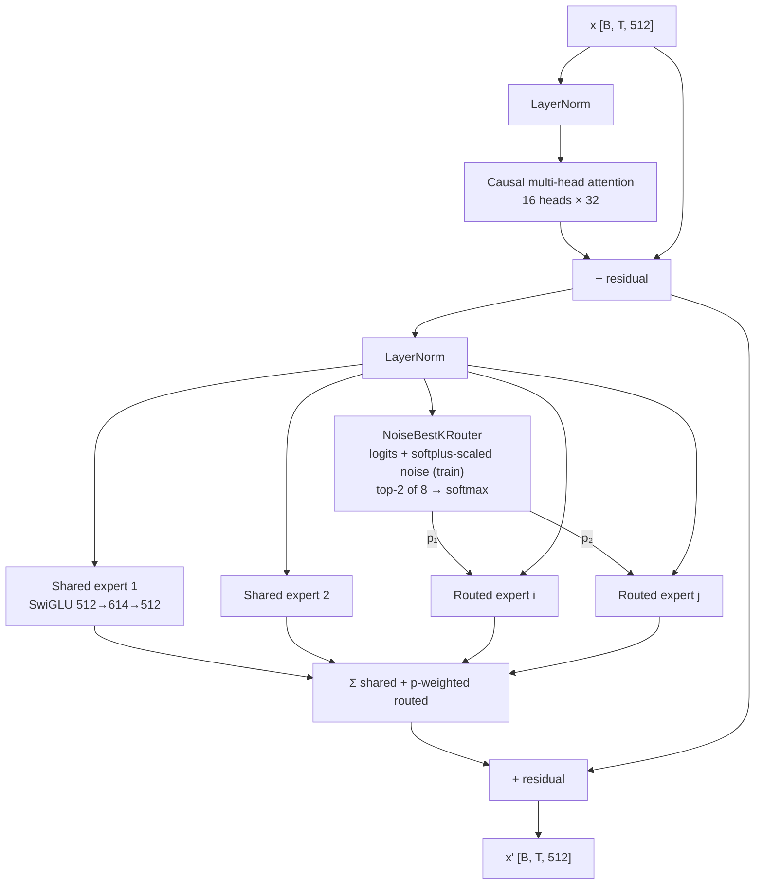
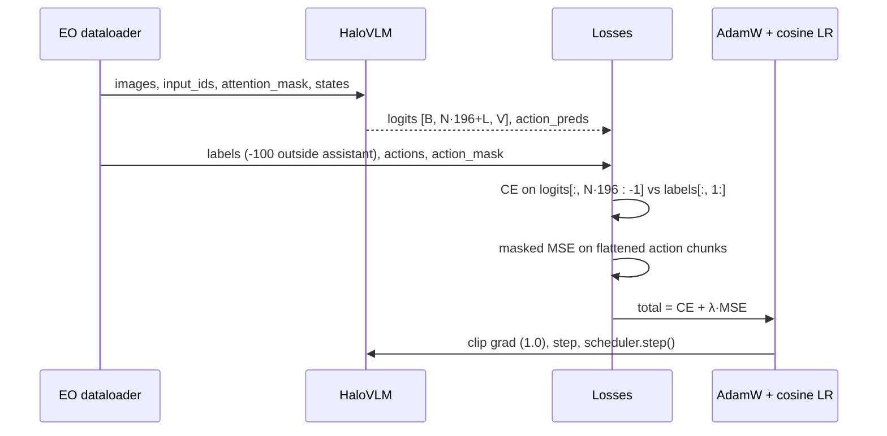
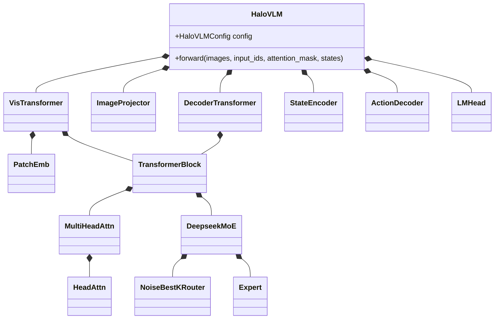

# Architecture

Diagrams are Mermaid and render on GitHub. The same diagrams appear on the
[project page](../project-page/index.html) and are described in Section 3 of the
[paper](../paper/main.tex).

## 1. System overview

## 2. How the three special tokens are handled

Resulting decoder sequence for one image:

## 3. Decoder block with DeepSeek-style MoE

The vision encoder uses the same block without the causal mask and with 16 routed
experts (top-4).

## 4. Training step

## 5. Module map

## Parameter budget (default config, measured)

| Module | Params |
|---|---|
| Vision encoder | 72.7M |
| Image projector | 0.23M |
| Token embedding | 77.7M |
| Position embedding | 1.0M |
| Decoder | 125.9M (≈58M active per token) |
| LM head | 77.7M |
| State encoder | 0.40M |
| Action decoder | 0.40M |
| **Total** | **355.9M** |
