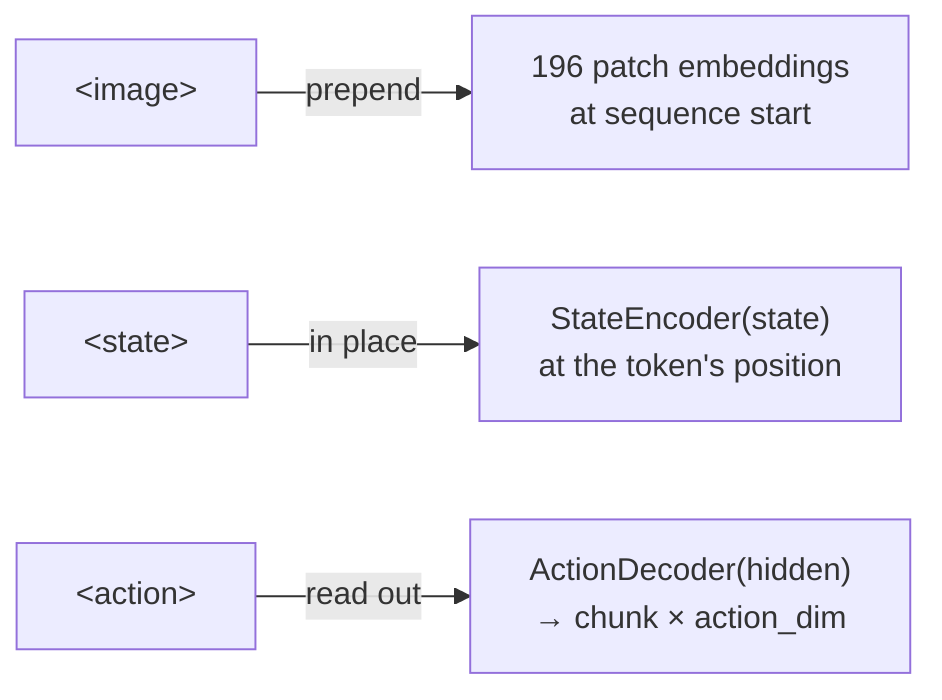

# Three tokens and a router: building a VLA from scratch

*2026-09-28 · B A NaveenKumar*

> **Summary.** Hale-VLA is a 356M-parameter vision-language-action model written from
> scratch in PyTorch. Three special tokens — `<image>`, `<state>` and `<action>` — let one
> causal transformer read camera frames and robot state and write both text and
> continuous actions. Each decoder layer uses a DeepSeek-style mixture-of-experts. This
> post walks through the design choices and the pitfalls to watch for.

## Why build a VLA from scratch?

The popular recipe for a robot foundation model is to take a multi-billion-parameter
vision-language model and fine-tune it on robot data. It works, but it's hard to *see*
what's going on. If you want to know whether proprioception belongs at the start of the
prompt or next to the image it came with, or whether sparse experts help control, you end
up editing someone else's 20,000-line modelling file.

Hale-VLA goes the other way: every component is a few dozen lines, and the whole model
fits in your head.

## One sequence, three tokens

Everything the model sees and does is a chat transcript in Qwen2.5's format. Three new
tokens mark where non-text information goes:

```
<|im_start|>user
<image> What should the robot do next? Current state: <state><|im_end|>
<|im_start|>assistant
Move the gripper above the cup. <action><|im_end|>
```

Each token is handled differently, and that difference is the core idea:

| Token | Pattern | What happens |
|---|---|---|
| `<image>` | **prepend** | the image runs through a ViT; its 196 patch embeddings go at the front of the sequence |
| `<state>` | **in-place** | the placeholder embedding is overwritten by an MLP encoding of the state vector |
| `<action>` | **read-out** | after the decoder, the hidden state at this position goes to an MLP that outputs an action chunk |



Why not treat all three the same way? Images are big (196 tokens each) and every later
token should see them, so putting them first under a causal mask is simplest. States are
tiny and *temporal*: in an interleaved trajectory, state 3 belongs next to frame 3, not
at the start. And actions are outputs, so the `<action>` token works like a learned query
that asks, "given everything so far, what should the arm do?"

## A mixture-of-experts decoder

Every decoder block is pre-norm attention followed by a DeepSeekMoE layer:

- **2 shared experts** that every token uses, for the transformations everyone needs;
- **8 routed experts**, of which each token picks the **top 2** through a noisy router
  (Gaussian noise scaled by a learned softplus, only during training).

All experts are SwiGLU MLPs. In the default configuration the decoder holds 126M
parameters, but only about 58M are active for a given token. The hope, still to be
tested, is that routed experts specialise by modality: some for visual patches, some for
dialogue, some for the positions that feed the action head.

## Training on EO-Data1.5M

The dataloader wraps EO-Data1.5M, the interleaved embodied corpus from EO-1: 5
interleaved subsets (free chat, temporal reasoning, trajectories, and so on) and 12 QA
subsets (affordances, failure detection, task planning, and so on). Two details were
important:

1. **Only assistant tokens are supervised.** The system prompt and user turns get label
   `-100`. That's standard for chat models, but it's easy to get wrong when image tokens
   change the sequence length.
2. **Everything is padded per batch**: number of images, text length, action steps and
   state steps, each with its own mask.

The loss is `cross-entropy(text) + λ · masked-MSE(actions)`.

## The subtle part: off-by-196

Because image patches are prepended, the logits tensor is `[B, N·196 + L, V]` while the
labels are `[B, L]`. If you compare logits position *t* with label position *t*, you end
up training the model to predict text from image patches. The loss still goes down, so
nothing looks wrong, but the model learns nothing useful.

The correct loss slices `logits[:, N·196 : -1]` and compares with `labels[:, 1:]`. The
same offset applies when reading out `<action>` hidden states. Because this kind of bug is
silent, the training script renders **videos** every few hundred steps, with input frames,
question, predicted and true answers, and predicted and true action curves side by side.
Misalignments show up as nonsense within minutes.

## What's next

- Measured QA accuracy and action error on held-out EO-Data (the paper's experiments
  section lists the protocol).
- Ablations: dense vs MoE, shared experts on/off, state in place vs prepended.
- A flow-matching action head to capture multi-modal action distributions.
- A pretrained vision tower (SigLIP) as an option in place of the from-scratch ViT.

The code, paper and diagrams are in the
[repository](https://github.com/basaanithanaveenkumar/Hale-VLA). Issues and pull
requests are welcome.
