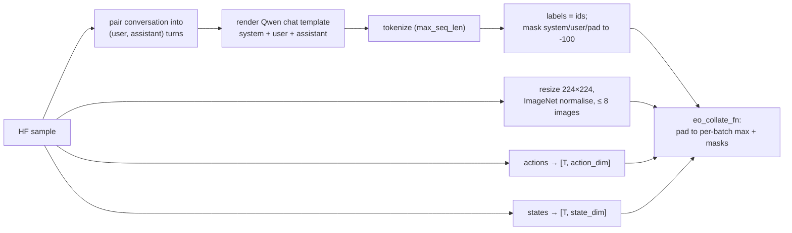

# Data: EO-Data1.5M

`dataloader/eo_dataset.py` wraps
[`IPEC-COMMUNITY/EO-Data1.5M`](https://huggingface.co/datasets/IPEC-COMMUNITY/EO-Data1.5M),
the interleaved embodied corpus released with EO-1.

## Subsets

| Kind | Subsets |
|---|---|
| Interleaved (5) | `interleave-free_chat`, `interleave-random_qa`, `interleave-temporal`, `interleave-trajectory`, `interleave-video_caption` |
| QA (12) | `qa-affordance_qa`, `qa-episode_caption`, `qa-failure_detection`, `qa-multiview_qa`, `qa-object_referring_qa`, `qa-physical_common_sense`, `qa-points_qa`, `qa-process_verification`, `qa-relation_reasoning`, `qa-subtask_qa`, `qa-task_planning`, `qa-trajectory_qa` |

Raw fields per sample: `source`, `conversation` (list of `{from, value}`), `image`
(one or many PIL images), `action` (continuous chunks, may be missing) and `state`.

## From sample to tensors



## Batch format (`eo_collate_fn`)

| Key | Shape | Notes |
|---|---|---|
| `images` | `[B, max_N, 3, H, W]` | zero-padded |
| `image_mask` | `[B, max_N]` | 1 = real image |
| `input_ids` | `[B, L]` | right-padded with the pad id |
| `attention_mask` | `[B, L]` | |
| `labels` | `[B, L]` | `-100` outside assistant turns |
| `actions` | `[B, T_act, action_dim]` | |
| `action_mask` | `[B, T_act]` | |
| `states` | `[B, T_state, state_dim]` | |
| `state_mask` | `[B, T_state]` | |

## Building a loader

```python
from dataloader.eo_dataset import build_eo_dataloader

loader = build_eo_dataloader(subset="qa-task_planning", batch_size=4,
                             max_seq_len=512, action_dim=32, state_dim=32,
                             max_samples=1000, shuffle=True)
batch = next(iter(loader))
```
