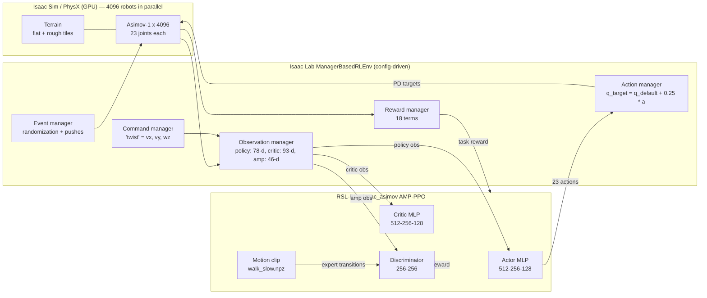

# Chapter 0 — Prologue: The Last Lane Change

*[← Contents](README.md) · [Next: Meet Asimov‑1 →](01-meet-asimov.md)*

---

It's 11:40 p.m. and you're staring at a validation dashboard for the
lane-change planner. The false-positive rate on cut-in detection finally
dropped below target. Six months of data mining, relabeling, and arguing about
what counts as a "cut-in" have paid off. You should feel great.

Instead you're watching a video on your second monitor. A humanoid robot is walking across a cobblestone courtyard. Someone
shoves it from the side. It stumbles, takes two quick corrective steps, and
keeps walking as if nothing happened.

You watch it four times. Then you open the repository that trained that
policy, and the first surprising thing you notice is how *small* it is.

```
isaac_asimov/
├── isaac_asimov.sh          ← a 30-line launcher
├── quick_install.sh         ← a 30-line installer
├── scripts/rsl_rl/          ← train.py, play.py
├── source/isaac_asimov/     ← the actual extension (~2,500 lines)
├── tests/                   ← unit tests for the AMP pieces
└── third_party/             ← Isaac Lab + the robot's model
```

Your lane-change planner has more lines in its *config validation* code.

This book is the story of how you go from that moment to understanding every
line of that repository, and to being able to change it with confidence. But
before we look at a single file, we need an honest conversation about what's
about to change in your head.

## The five shifts

### Shift 1: From "predict the label" to "earn the reward"

In AD perception you live in supervised learning. There's an image, there's a
bounding box someone drew, and the loss says how far you are from it. The
gradient points in a direction that is *known to be correct*.

In humanoid locomotion, nobody can label the "correct" torque for the left
ankle at time step 3,512. There is no ground truth action. There is only a
**reward**: a number the environment hands back that says "that was good" or
"that was bad", often long after the action that mattered.

> 🚗 **Driving Déjà Vu**
> You've met this before if you've worked on planning. A planner's cost
> function (comfort + progress + safety margin) is a reward in disguise. The
> difference is that your planner *optimized* the cost online at every tick.
> Reinforcement learning (RL) instead trains a network *offline* that has
> learned to produce low-cost actions directly. It's like distilling your
> MPC into a network, except the "teacher" is the reward itself and trial and
> error.

### Shift 2: From "the world is given" to "you build the world"

Your AD dataset came from a fleet. Petabytes of real driving. The world was
real, and your job was to understand it.

In this repo **there is no dataset** in the usual sense. (There's one
five-megabyte motion clip, which we'll meet in Chapter 8.) The data is
generated on the fly by a physics simulator running **4,096 copies of the
robot in parallel** on a single GPU. You don't collect data; you *design the
world* that produces it, then let the robot live in it for about a billion
time steps.

That design (what the terrain looks like, how the robot is pushed, how noisy
its sensors are) turns out to matter more than the network architecture.
The network here is a boring three-layer MLP. The world is where the craft is.

### Shift 3: From "stable by default" to "falling is the default"

A car is **statically stable**. If your planner outputs garbage for 100 ms,
the car keeps rolling in a straight line. Four wheels on the ground form a
huge support polygon. Nothing bad happens instantly.

A humanoid is **dynamically stable** at best. Its support polygon is one or two
feet. Its center of mass sits about 60 cm above the ground. If the policy
outputs garbage for 100 ms, the robot is already falling, and at a 50 Hz
control rate that's only five decisions.

> 🚗 **Driving Déjà Vu**
> Remember the difference between lateral control at 5 km/h and at 130 km/h?
> At high speed, latency and oscillation suddenly matter a lot. A humanoid is
> like driving at 130 km/h *all the time*, on ice, with a vehicle whose
> steering geometry changes with every step.

### Shift 4: From "two actuators" to "twenty-three"

Your car has, practically speaking, two control channels: steering and
longitudinal acceleration (throttle/brake). Asimov‑1 has **23 actuated joints**:
six per leg, one waist, five per arm. And they're all coupled. Moving the arm
shifts the center of mass, which changes the load on the ankle, which changes
how much the foot can grip.

### Shift 5: From "sim is a test tool" to "sim is the training set"

In AD, simulation (CARLA, your in-house resimulator, log replay) is mostly
for *testing*. The model learns from real data and gets validated in sim.

In legged robotics it's inverted. The policy learns **entirely in simulation**
and then runs on the real robot with **zero real-world training data**. This
is called *sim-to-real transfer*, and it only works because the simulated world
is deliberately made messier and more varied than the real one. Chapter 6 is
all about that trick.

## What stays the same (the good news)

You're not starting from zero. Far from it.

- **PyTorch is PyTorch.** The policy is an `nn.Module`. The optimizer is Adam.
  Gradients are clipped. You'll recognize everything in
  `algorithms/amp_ppo.py`.
- **GPUs are your friends.** Thinking in batched tensors, `[num_envs, ...]`
  shapes, avoiding Python loops: all of it carries over. The whole simulator
  state lives on the GPU as tensors.
- **Data pipelines still matter.** Observation normalization, noise
  injection, and consistent ordering between training and deployment are the
  same class of bugs you've fought with sensor calibration and preprocessing.
- **Deployment discipline still matters.** You've exported models to ONNX
  and TensorRT and had them silently disagree with PyTorch. The same
  pain awaits, with an extra twist: if the numbers disagree here, a real
  robot falls on its face.
- **GANs.** If you ever trained a GAN (maybe for data augmentation or
  sim-to-real image translation), you'll feel at home in Chapter 8. The
  repo's headline feature, **Adversarial Motion Priors (AMP)**, is a GAN whose
  "generator" is the walking policy itself.

## The whole system on one page

Before diving in, here's the big picture. Keep coming back to it.



If that diagram looks like a lot, good. By Chapter 8 you'll be able to redraw it
from memory and explain every arrow.

## A quick tour of what the repo can do

The README gives four registered tasks (think of them as "experiment
presets"):

| Task ID | What it is |
|---------|-----------|
| `Asimov1-Velocity-v0` | Plain PPO: learn to follow velocity commands using hand-crafted rewards only |
| `Asimov1-Velocity-Play-v0` | Same environment, but with randomization off, for watching a trained policy |
| `Asimov1-Velocity-AMP-v0` | PPO + AMP: the same rewards *plus* a learned "does this look like natural walking?" reward |
| `Asimov1-Velocity-AMP-Play-v0` | Play version of the AMP task |

And the whole workflow is three commands:

```bash
./quick_install.sh                                   # once
./isaac_asimov.sh --train --task Asimov1-Velocity-AMP-v0 --num_envs 4096 --headless
./isaac_asimov.sh --play  --task Asimov1-Velocity-AMP-Play-v0 --num_envs 32
```

The README estimates the quick test (128 environments, 100 iterations) at about
ten minutes on an RTX 4090. The full run uses 4,096 environments and up to
10,000 iterations.

## What the robot is actually learning

Let's be precise, because precision is going to be our habit.

The trained policy is a function:

```
π(observation) → 23 numbers
```

- **Input:** a 78-number vector: how fast the torso is rotating, which way is
  "down" from the robot's point of view, the velocity command, the angle and
  speed of each joint, and the previous action.
- **Output:** 23 numbers, one per joint. Each one, multiplied by 0.25 and
  added to a default standing angle, becomes a **target joint angle**.
- **Rate:** 50 times per second.
- **Goal:** walk at the commanded forward, sideways and turning speed,
  without falling, in a way that looks natural and won't break the hardware.

That's it. No planner, no state machine, no footstep scheduler, no inverse
kinematics. One MLP, 50 Hz, joint targets out. All the "intelligence" of gait
(when to lift a foot, where to place it, how to swing the arms) *emerges* from
the rewards and the training.

> 🔧 **Under the Hood: why no footstep planner?**
> Classical humanoid control (the ASIMO and Atlas-of-2015 era) used a
> layered stack: a footstep planner, a center-of-mass trajectory generator
> using the Zero Moment Point (ZMP) or a linear inverted pendulum model, then
> whole-body inverse dynamics and a torque controller. That's exactly like the
> classic AD stack of perception → prediction → planning → control. Learned
> locomotion collapses those layers into one network, much like "end-to-end
> driving" tries to. The difference: for locomotion, end-to-end *won*
> clearly, because the simulator can generate unlimited, perfectly labeled
> physics.

## The cast of characters

Throughout the book you'll meet these recurring players:

- **Asimov‑1**: the robot. 23 actuated joints, with its pelvis about 64 cm
  off the ground when standing. Designed and sold by Menlo Research.
- **Isaac Sim**: NVIDIA's robotics simulator, built on the PhysX physics
  engine and the Omniverse/USD scene format.
- **Isaac Lab**: the robot-learning framework built on top of Isaac Sim. It
  gives you the "manager-based" environment where everything is a config.
- **RSL‑RL**: a lean PPO implementation from ETH Zurich's Robotic Systems Lab,
  the de facto standard for legged robot RL.
- **`isaac_asimov`**: the repo we're studying. It plugs into all of the
  above and adds the Asimov‑1 robot, its tasks, rewards, and the AMP algorithm.

## 🏁 Pit Stop

1. In AD perception, where does the "correct answer" come from? Where does it
   come from here?
2. Why is a 100 ms policy glitch more dangerous for a humanoid than for a car?
3. What are the input size, output size, and rate of the trained policy?
4. Which part of this repo would you expect to take the most engineering
   effort: the network architecture or the environment design?

<details>
<summary>Answers</summary>

1. From human labels. Here, from a scalar reward computed by hand-written
   functions (plus a learned discriminator in the AMP variant).
2. The robot is dynamically stable, with a tiny support polygon and a high
   center of mass. 100 ms is five control steps at 50 Hz, enough to fall.
3. 78 inputs, 23 outputs, 50 Hz.
4. Environment design. The network is a plain 3-layer MLP.

</details>

---

*[← Contents](README.md) · [Next: Meet Asimov‑1 →](01-meet-asimov.md)*
