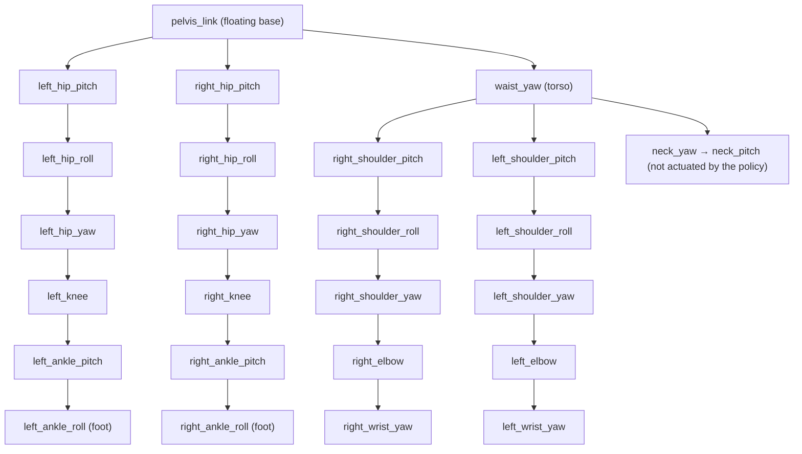

# Chapter 1 — Meet Asimov‑1

*[← Prologue](00-prologue.md) · [Contents](README.md) · [Next: Muscles Made of Math →](02-actuators-and-pd.md)*

---

On your first day in AD, someone probably handed you a vehicle spec sheet:
wheelbase, track width, steering ratio, max lateral acceleration, sensor
mounting positions. You learned the *body* before you learned the software.

We'll do the same. Our body lives in one file:
`source/isaac_asimov/isaac_asimov/assets/robots/asimov_1.py`.

## 1.1 Where the robot comes from: the URDF

The top of the file answers a simple question: *where is the robot's model on
disk?*

```python
# source/isaac_asimov/isaac_asimov/assets/robots/asimov_1.py
_REPOSITORY_ROOT = Path(__file__).resolve().parents[5]
ASIMOV_1_MODEL_DIR = str(_REPOSITORY_ROOT / "third_party" / "asimov-1" / "sim-model")
ASIMOV_1_URDF_PATH = str(
    Path(os.environ.get("ASIMOV_1_MODEL_DIR", ASIMOV_1_MODEL_DIR)).expanduser() / "urdf" / "asimov_1.urdf"
)
```

Three things are happening:

1. `parents[5]` walks up five directories from this file to the repository
   root. (Count them: `robots → assets → isaac_asimov → isaac_asimov →
   source → repo root`.)
2. The default model location is the `third_party/asimov-1/sim-model` git
   submodule, which points to Menlo's hardware repo
   (`github.com/menloresearch/asimov-1`).
3. An environment variable, `ASIMOV_1_MODEL_DIR`, can override it. `INSTALL.md`
   notes this is required for non-editable installs, because `parents[5]`
   only lands on the repo root when the package is used from its checkout.

> ⚠️ **Pothole**
> The `asimov-1` hardware repo is large (it contains CAD and fabrication
> files). The install scripts use a *sparse checkout* to fetch only
> `sim-model/`:
> ```bash
> git submodule update --init --filter=blob:none third_party/asimov-1
> git -C third_party/asimov-1 sparse-checkout set sim-model
> ```
> If you run a plain `git submodule update --init --recursive`, you'll
> download far more than you need.

### What's a URDF?

**URDF** (Unified Robot Description Format) is an XML file that describes a
robot as a tree:

- **Links** are rigid bodies: a thigh, a shin, a foot. Each has mass,
  inertia, a visual mesh and a collision shape.
- **Joints** connect a parent link to a child link and define how the child
  can move: rotate about an axis (`revolute`), slide (`prismatic`), or not at
  all (`fixed`). Each has position limits, velocity limits and effort
  (torque) limits.

> 🚗 **Driving Déjà Vu**
> A URDF is the robot's equivalent of your vehicle's **TF tree** plus its
> **sensor calibration file** plus its **dynamics parameters** (mass, inertia,
> wheelbase) all in one. If you've used ROS in AD, you've probably already
> seen a URDF describing where the LiDAR sits relative to `base_link`. Same
> format, just with a lot more moving parts.

## 1.2 The 23 joints

Here's the canonical joint list, and the order matters (we'll see why in
Chapter 10):

```python
ASIMOV_1_JOINT_NAMES = [
    "left_hip_pitch_joint",      #  0
    "left_hip_roll_joint",       #  1
    "left_hip_yaw_joint",        #  2
    "left_knee_joint",           #  3
    "left_ankle_pitch_joint",    #  4
    "left_ankle_roll_joint",     #  5
    "right_hip_pitch_joint",     #  6
    "right_hip_roll_joint",      #  7
    "right_hip_yaw_joint",       #  8
    "right_knee_joint",          #  9
    "right_ankle_pitch_joint",   # 10
    "right_ankle_roll_joint",    # 11
    "waist_yaw_joint",           # 12
    "right_shoulder_pitch_joint",# 13
    "right_shoulder_roll_joint", # 14
    "right_shoulder_yaw_joint",  # 15
    "right_elbow_joint",         # 16
    "right_wrist_yaw_joint",     # 17
    "left_shoulder_pitch_joint", # 18
    "left_shoulder_roll_joint",  # 19
    "left_shoulder_yaw_joint",   # 20
    "left_elbow_joint",          # 21
    "left_wrist_yaw_joint",      # 22
]
```

(The index comments are added here for reference; they're not in the source.)

Let's visualize the kinematic tree. The **pelvis** is the root: the "base
link" that floats freely in the world.



The motion clip shipped with the repo lists **26 bodies**: the pelvis, 6 per
leg, the waist, 2 neck links, and 5 per arm. The neck joints exist in the
model, but they aren't in `ASIMOV_1_JOINT_NAMES` and have no actuator
configured, so the locomotion policy never controls them.

### Pitch, roll, yaw: a 30-second refresher

You know these from vehicle dynamics. On a joint they mean the axis of rotation
relative to the body:

- **Pitch**: rotation about the side-to-side axis. For a hip, that swings the
  leg forward and back. For an ankle, toes up/down.
- **Roll**: rotation about the forward axis. For a hip, that lifts the leg
  out to the side. For an ankle, rolls the foot inward/outward.
- **Yaw**: rotation about the vertical axis. For a hip, that twists the leg
  (toes in/out). For the waist, it turns the torso.

Each leg has 6 degrees of freedom (DoF): 3 at the hip, 1 at the knee, 2 at the
ankle. That's the minimum needed to put a foot at any position *and*
orientation within reach, which is why it's the standard humanoid leg layout.

> 🔧 **Under the Hood: a floating base**
> The robot has 23 actuated joints, but its *full* state has 23 + 6 = 29
> degrees of freedom. The extra 6 are the position (x, y, z) and orientation
> (roll, pitch, yaw) of the pelvis in the world. Those 6 are **unactuated**:
> no motor can push the pelvis directly. The only way to move the body is to
> push against the ground through the feet. That's the fundamental difficulty
> of legged locomotion, and it's why the config says `fix_base=False`. A
> robot arm bolted to a table would use `fix_base=True`.
>
> In car terms: your vehicle's pose is also "unactuated"; you move it only via
> tire forces. But tires are always touching the ground. Feet are not.

## 1.3 The standing pose

The robot needs a "home" configuration. That's `ASIMOV_1_STANDING_INIT_STATE`:

```python
ASIMOV_1_STANDING_INIT_STATE = ArticulationCfg.InitialStateCfg(
    pos=(0.0, 0.0, 0.639),      # pelvis spawns 63.9 cm above the ground
    joint_pos={
        "left_hip_pitch_joint": -0.15,
        "right_hip_pitch_joint": 0.15,
        ".*_hip_roll_joint": 0.0,
        ".*_hip_yaw_joint": 0.0,
        "left_knee_joint": 0.45,
        "right_knee_joint": -0.45,
        "left_ankle_pitch_joint": -0.30,
        "right_ankle_pitch_joint": 0.30,
        ".*_ankle_roll_joint": 0.0,
        "waist_yaw_joint": 0.0,
        "left_shoulder_pitch_joint": -0.25,
        "right_shoulder_pitch_joint": 0.25,
        "left_shoulder_roll_joint": -0.05,
        "right_shoulder_roll_joint": 0.05,
        ".*_shoulder_yaw_joint": 0.0,
        "left_elbow_joint": 0.40,
        "right_elbow_joint": -0.40,
        ".*_wrist_yaw_joint": 0.0,
    },
    joint_vel={".*": 0.0},
)
```

Several things are worth noticing:

**1. Keys are regular expressions.** `".*_hip_roll_joint"` matches both the
left and right hip roll. Isaac Lab uses regex matching everywhere, in
actuators, observations and rewards. Get used to reading them.

**2. Left and right have opposite signs.** Left knee is `+0.45`, right knee
is `-0.45`. That's not a bent-one-way, bent-the-other-way posture. It means
the joint *axes* are almost certainly mirrored in the URDF (open
`asimov_1.urdf` and compare the `<axis>` tags to confirm). Both knees are bent by the same
physical amount (about 26°). This is extremely common in humanoid models and
extremely easy to get wrong when writing code by hand.

> ⚠️ **Pothole**
> If you ever write a mirroring function (for example, for symmetry
> augmentation), you *cannot* just swap left and right values. You must
> also flip signs for joints whose axes are mirrored, and you need to check
> each joint's axis in the URDF. Getting one sign wrong gives you a policy
> that learns to limp.

**3. It's a crouch.** Hips flexed (−0.15/+0.15 rad), knees bent (±0.45 rad),
ankles compensating (∓0.30 rad). Walking robots almost never stand with
straight knees, for the same reason you don't catch a ball with locked
knees: a bent knee has room to absorb impacts and adjust height. It also
keeps the knee away from its *singularity* (fully straight), where small joint
motions barely change foot height.

**4. The arms are slightly out and bent.** Shoulders pitched ±0.25, rolled
±0.05, elbows bent ±0.40. That keeps the hands clear of the hips, which
matters because (spoiler for Chapter 5) there's a self-collision penalty.

**5. The numbers are radians.** Always. Everything in Isaac Lab uses radians
and SI units.

This pose does double duty. It's where every episode starts, and it's the
**default joint position** that the policy's actions are measured *relative
to*. When the policy outputs all zeros, the robot tries to hold this pose.
We'll see that in the next chapter.

## 1.4 Spawning the robot: the ArticulationCfg

At the bottom of the file, everything comes together:

```python
ASIMOV_1_DELAYED_CFG = ArticulationCfg(
    spawn=sim_utils.UrdfFileCfg(
        asset_path=ASIMOV_1_URDF_PATH,
        fix_base=False,
        merge_fixed_joints=True,
        joint_drive=sim_utils.UrdfFileCfg.JointDriveCfg(
            target_type="position",
            gains=sim_utils.UrdfFileCfg.JointDriveCfg.PDGainsCfg(stiffness=0.0, damping=0.0),
        ),
        activate_contact_sensors=True,
        rigid_props=sim_utils.RigidBodyPropertiesCfg(
            disable_gravity=False,
            retain_accelerations=False,
            linear_damping=0.0,
            angular_damping=0.0,
            max_linear_velocity=1000.0,
            max_angular_velocity=1000.0,
            max_depenetration_velocity=1.0,
        ),
        articulation_props=sim_utils.ArticulationRootPropertiesCfg(
            enabled_self_collisions=True,
            solver_position_iteration_count=8,
            solver_velocity_iteration_count=4,
        ),
    ),
    init_state=ASIMOV_1_STANDING_INIT_STATE,
    soft_joint_pos_limit_factor=0.9,
    actuators=ASIMOV_1_ACTUATORS,
)
```

Let's decode each choice:

| Setting | Meaning | Why it's set this way |
|---------|---------|------------------------|
| `UrdfFileCfg` | Import from URDF (converted to USD internally by Isaac Sim) | The robot's source of truth is URDF |
| `fix_base=False` | Pelvis is free-floating | It's a walking robot |
| `merge_fixed_joints=True` | Links connected by fixed joints get merged into one body | Fewer bodies means faster simulation. Sensor mounts and decorative parts fold into their parent. |
| `target_type="position"`, gains `0.0` | The *simulator's* built-in joint drive is turned **off** | The actuator model (next chapter) computes torques explicitly. Two PD controllers fighting each other would be a bug. |
| `activate_contact_sensors=True` | Bodies can report contact forces | Needed for feet contact and self-collision sensors |
| `disable_gravity=False` | Gravity applies | You'd be amazed how often this gets flipped while debugging |
| `linear_damping=0.0`, `angular_damping=0.0` | No artificial air drag on bodies | Realism. Damping makes sim look stable when real life isn't. |
| `max_depenetration_velocity=1.0` | When bodies overlap, PhysX pushes them apart at most 1 m/s | Prevents "explosions" when a foot spawns slightly inside the ground |
| `enabled_self_collisions=True` | The robot's own links can collide with each other | Otherwise, legs could pass through each other and the policy would exploit it |
| `solver_position_iteration_count=8`, `velocity=4` | PhysX solver iterations per step | More iterations mean more accurate contacts at higher cost; 8/4 is a common legged-robot setting |
| `soft_joint_pos_limit_factor=0.9` | "Soft" limits are 90% of the URDF's hard range | Used by the joint-limit penalty so the robot learns to stay away from hard stops |

> 🚗 **Driving Déjà Vu**
> `solver_position_iteration_count` is like the number of iterations your
> MPC solver runs per cycle. Too few, and constraints (here: "feet don't go
> through the floor") are violated. Too many, and you blow your compute
> budget. 4,096 robots × 200 physics steps per second is a lot of solving.

## 1.5 The name "DELAYED"

The config is called `ASIMOV_1_DELAYED_CFG`, not `ASIMOV_1_CFG`. That
"delayed" refers to the actuators, which simulate a random communication delay
between "policy decides" and "motor acts". That's the subject of the next
chapter, and it's one of the most important sim-to-real tricks in the repo.

## 1.6 Bodies you'll hear about again

Several link names are singled out by other parts of the code. Here they are
in one place:

| Link | Used for | Where |
|------|----------|-------|
| `left_ankle_roll_link`, `right_ankle_roll_link` | "Feet": contact sensing, foot height, slip, clearance | `velocity_env_cfg.py` (`FEET_BODIES`) |
| `waist_yaw_link` | "Torso": uprightness, angular velocity penalty, center-of-mass randomization | `velocity_env_cfg.py` (`TORSO_BODY`) |
| `pelvis_link` | AMP "anchor" (the reference frame for body positions in the motion clip) | `amp_env_cfg.py` |
| wrists, elbows, knees, ankles | Self-collision sensing | `velocity_env_cfg.py` (`self_collision`) |

Notice that the "foot" is the ankle-roll link. There's no separate foot link,
because the foot is rigidly attached to the last ankle joint (and
`merge_fixed_joints=True` would have merged it anyway). The code also defines
a **foot site offset** of `(0.05, 0.0, -0.025)` meters in
`mdp/observations.py`: a point 5 cm forward and 2.5 cm down from the ankle-roll
link's origin, roughly the middle of the sole. When the code talks about
"foot height", it means the height of *that point*, not the ankle joint.

## 🏁 Pit Stop

1. What are the three sources of the 29 degrees of freedom of the robot's
   full state?
2. Why does the left knee default to `+0.45` and the right to `-0.45`?
3. Why is the simulator's built-in joint drive stiffness set to `0.0`?
4. What would happen if you set `enabled_self_collisions=False`?
5. What point on the robot does "foot height" refer to?

<details>
<summary>Answers</summary>

1. 23 actuated joints + 3 base position + 3 base orientation.
2. The joint axes are mirrored between left and right in the URDF; the
   physical bend is the same.
3. Torques are computed by the explicit `DelayedPDActuator` model instead;
   the built-in drive must not also apply torques.
4. Links could pass through each other. The policy could learn gaits that
   would slam the real robot's legs into each other.
5. A site 5 cm forward and 2.5 cm below the ankle-roll link origin
   (`FOOT_SITE_OFFSET`), roughly the middle of the sole.

</details>

---

*[← Prologue](00-prologue.md) · [Contents](README.md) · [Next: Muscles Made of Math →](02-actuators-and-pd.md)*
