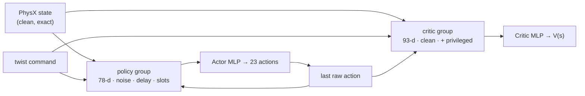

# Chapter 4 — The MDP Is a Config File: Scene, Commands, Actions, and Observations

*[← A Thousand Worlds per Second](03-simulation-and-repo-tour.md) · [Contents](README.md) · [Next: Speaking Robot: Rewards →](05-rewards.md)*

---

In AD, when a new engineer asks "what does the model see?", someone sends them
a diagram of the sensor suite and the input tensor spec. In reinforcement
learning, the equivalent question is "what's the MDP?", and in this repo the
answer is a single file: `tasks/locomotion/velocity_env_cfg.py`, 570 lines.

By the end of this chapter you'll know exactly what the robot sees, what it's
asked to do, and what its world looks like. The next two chapters cover the
rest of the file: rewards, randomization and terminations.

## 4.1 A 90-second MDP primer

A **Markov Decision Process** is the formal frame for RL:

- **State `s`**: everything about the world right now.
- **Observation `o`**: the part of the state the agent actually sees.
- **Action `a`**: what the agent does.
- **Transition**: the physics that maps `(s, a)` to the next state `s'`.
- **Reward `r`**: a scalar score for what just happened.
- **Termination**: when an episode ends (the robot fell, or time ran out).
- **Policy `π(a | o)`**: the agent's behavior, here a neural network.

The goal: find the policy that maximizes the expected discounted sum of
rewards, `E[Σ γᵗ rₜ]`.

In Isaac Lab's manager-based design, each piece of the MDP is a config
section, and each section is handled by a manager:

```python
@configclass
class Asimov1VelocityEnvCfg(ManagerBasedRLEnvCfg):
    scene: Asimov1SceneCfg = Asimov1SceneCfg(num_envs=4096, env_spacing=2.5)  # the world
    observations: ObservationsCfg = ObservationsCfg()   # what the agent sees
    actions: ActionsCfg = ActionsCfg()                   # what the agent controls
    commands: CommandsCfg = CommandsCfg()                # what the agent is asked to do
    rewards: RewardsCfg = RewardsCfg()                   # how it's scored
    terminations: TerminationsCfg = TerminationsCfg()    # when episodes end
    events: EventCfg = EventCfg()                        # randomization and disturbances
```

> 🚗 **Driving Déjà Vu**
> Think of the **command** as the *route* or *goal* from your AD mission
> planner, the **observation** as the input tensor spec of your model, the
> **action** as the control interface to drive-by-wire, and the **reward** as
> your planner's cost function with a sign flip. **Events** are your scenario
> generator's randomization knobs. **Terminations** are the conditions that
> end a simulation run (collision, off-road, timeout).

## 4.2 The scene: cobblestones and contact sensors

### The terrain

```python
COBBLESTONE_ROAD_CFG = terrain_gen.TerrainGeneratorCfg(
    size=(8.0, 8.0),          # each tile is 8 m × 8 m
    border_width=20.0,        # flat border around the whole grid
    num_rows=9,
    num_cols=21,              # 9 × 21 = 189 tiles
    difficulty_range=(0.0, 1.0),
    use_cache=False,
    curriculum=False,         # no difficulty progression
    sub_terrains={
        "flat": terrain_gen.MeshPlaneTerrainCfg(proportion=0.2),
        "random_rough": terrain_gen.HfRandomUniformTerrainCfg(
            proportion=0.2,
            noise_range=(0.02, 0.05),
            noise_step=0.02,
            horizontal_scale=0.1,
            vertical_scale=0.005,
            border_width=0.25,
        ),
    },
)
```

The world is a grid of 189 tiles, each 8 m square, surrounded by a 20 m flat
border. Each tile is either:

- **`flat`**: a perfectly flat plane.
- **`random_rough`**: a height field with random bumps on a 10 cm grid.

The two proportions are both 0.2. Proportions are relative weights, so this
means **half flat, half rough**.

> 🔧 **Under the Hood: how rough is "rough"?**
> The height-field generator converts the noise settings into integer units
> of `vertical_scale` (5 mm): min = 0.02/0.005 = 4, max = 0.05/0.005 = 10, step =
> 0.02/0.005 = 4. It then samples heights from `np.arange(4, 10 + 4, 4)` =
> `[4, 8, 12]`, which is **2, 4 or 6 cm**. So neighboring 10 cm cells can
> differ by up to 4 cm. That's the "cobblestone" in `COBBLESTONE_ROAD_CFG`: not
> a staircase, but enough to catch a toe and punish a lazy, low foot swing.
> Reading the generator source to find out what your config *actually*
> produces is a habit worth building.

Two more settings in the scene config matter:

```python
terrain = TerrainImporterCfg(
    prim_path="/World/ground",
    terrain_type="generator",
    terrain_generator=COBBLESTONE_ROAD_CFG,
    max_init_terrain_level=COBBLESTONE_ROAD_CFG.num_rows - 1,   # = 8
    collision_group=-1,
    physics_material=sim_utils.RigidBodyMaterialCfg(
        friction_combine_mode="multiply",
        restitution_combine_mode="multiply",
        static_friction=1.0,
        dynamic_friction=1.0,
    ),
    debug_vis=False,
)
```

- `max_init_terrain_level = 8` lets robots start on any of the 9 rows. With
  `curriculum=False`, there's no "graduate to harder terrain" mechanic. The
  robots are spread across the grid from the start.
- **Friction combine mode `multiply`**: when a foot touches the ground, the
  effective friction is `foot_friction × ground_friction`. The ground is 1.0,
  so the foot's (randomized) friction decides. We'll see that randomization in
  Chapter 6.

When a terrain generator is used, each robot's spawn point comes from the
terrain tiles rather than from `env_spacing`; the tiles are what spread
robots out.

### The robot and its sensors

```python
robot: ArticulationCfg = ASIMOV_1_DELAYED_CFG.replace(prim_path="{ENV_REGEX_NS}/Robot")

feet_contact = ContactSensorCfg(
    prim_path="{ENV_REGEX_NS}/Robot/.*_ankle_roll_link",
    history_length=3,
    track_air_time=True,
)
self_collision = ContactSensorCfg(
    prim_path="{ENV_REGEX_NS}/Robot/.*_(wrist_yaw|elbow|knee|ankle_roll)_link",
    filter_prim_paths_expr=[
        "{ENV_REGEX_NS}/Robot/pelvis_link",
        "{ENV_REGEX_NS}/Robot/waist_yaw_link",
        "{ENV_REGEX_NS}/Robot/.*_hip_pitch_link",
        "{ENV_REGEX_NS}/Robot/.*_hip_roll_link",
        "{ENV_REGEX_NS}/Robot/.*_hip_yaw_link",
        "{ENV_REGEX_NS}/Robot/.*_shoulder_roll_link",
    ],
)
```

Two contact sensors, with very different jobs:

**`feet_contact`** watches both feet. It stores net contact forces with a
3-step history and tracks **air time** (how long each foot has been off
the ground) and contact time. It feeds the gait rewards: air time, swing
height, slip, stumble, and landing impact.

**`self_collision`** watches the "extremities": wrists, elbows, knees and
feet. The `filter_prim_paths_expr` list makes it report a **force matrix**: for
each watched body, the force it receives from each *filtered* body (pelvis,
torso, hip links, shoulder roll links). So it answers questions like "is
the right wrist hitting the pelvis?" or "is the left knee hitting the right
hip?" These are the collisions that hurt hardware and look terrible.

> 🚗 **Driving Déjà Vu**
> Contact sensors are the simulator's version of your **ground-truth
> annotations**. In AD, sim could tell you exact distances to every agent,
> which you'd never have in the real car. Same here: exact contact forces are
> easy in sim and hard on hardware (most robots don't have foot force
> sensors). That's why these signals are fed to the **critic** and used in
> **rewards**, but not given to the **policy**. More on that shortly.

Finally, a dome light (`sky_light`) so the rendered view isn't pitch black.
Purely cosmetic.

## 4.3 Commands: what the robot is asked to do

```python
@configclass
class CommandsCfg:
    twist = mdp.UniformVelocityCommandCfg(
        asset_name="robot",
        resampling_time_range=(3.0, 8.0),
        rel_standing_envs=0.2,
        rel_heading_envs=0.3,
        heading_command=True,
        heading_control_stiffness=0.5,
        debug_vis=True,
        ranges=mdp.UniformVelocityCommandCfg.Ranges(
            lin_vel_x=(-0.6, 0.8),
            lin_vel_y=(-0.5, 0.5),
            ang_vel_z=(-0.8, 0.8),
            heading=(0.0, 0.0),
        ),
    )
```

The command is called **`twist`** (a ROS term for a linear + angular velocity).
It's a 3-vector in the robot's own frame: `[vx, vy, ωz]`.

| Component | Range | Meaning |
|-----------|-------|---------|
| `vx` | −0.6 to +0.8 m/s | Forward/backward. Forward is faster, as for people. |
| `vy` | −0.5 to +0.5 m/s | Sideways (strafing) |
| `ωz` | −0.8 to +0.8 rad/s | Turning rate (about 46°/s) |

Each environment gets a fresh random command every **3 to 8 seconds**. With
20 s episodes, a robot sees roughly 3 to 6 different commands per episode, so
it must learn to *transition* between gaits, not just hold one.

Two special cases shape the distribution:

- **Standing envs (20%)**: At each resample, an environment has a 20% chance
  of getting an all-zero command. Standing still is a skill, and a
  surprisingly hard one for a policy that loves to walk.
- **Heading envs (30%)**: With `heading_command=True`, 30% of environments
  ignore the sampled `ωz` and instead compute it with a P-controller:
  `ωz = clip(0.5 × wrap(heading_target − current_heading), −0.8, 0.8)`. The
  heading range is `(0.0, 0.0)`, so the target heading is always 0 in the
  world frame. Those robots are steered to face the world +x axis.

> 🚗 **Driving Déjà Vu**
> This is exactly the interface between a behavior planner and a low-level
> controller: "go this fast, turn this much". In this setup, the policy is
> the *controller*, and someone else (a joystick, a navigation stack, or a
> VLA model) supplies the commands. Keep that in mind: the locomotion policy
> is a *building block* for higher-level autonomy, the same way your
> trajectory-tracking controller is a building block for your planner.

## 4.4 Actions (recap)

We covered this in Chapter 2: 23 joint position targets, in
`ASIMOV_1_JOINT_NAMES` order, scaled by 0.25, offset by the default pose.

## 4.5 Observations: what the robot sees

This is the most important section of the file for deployment, because
**whatever you observe in sim, you must reproduce exactly on the real robot**.

There are two observation groups: `policy` (for the actor) and `critic`
(for the value function). That split is called an **asymmetric actor-critic**.

### The policy group (the robot's senses)

```python
@configclass
class PolicyCfg(ObsGroup):
    base_ang_vel = ObsTerm(
        func=mdp.delayed_obs,
        params={"quantity": "base_ang_vel", "min_lag": 0, "max_lag": 1},
        noise=Unoise(n_min=-0.01, n_max=0.01),
        scale=0.25,
    )
    projected_gravity = ObsTerm(
        func=mdp.delayed_obs,
        params={"quantity": "projected_gravity", "min_lag": 0, "max_lag": 2},
        noise=Unoise(n_min=-0.02, n_max=0.02),
    )
    command = ObsTerm(func=mdp.generated_commands, params={"command_name": "twist"})
    joint_pos_slot01 = ObsTerm(func=mdp.joint_pos_rel, params={"asset_cfg": _slot_cfg(SLOT_0_1)}, noise=Unoise(-0.01, 0.01))
    joint_pos_slot23 = ...   # same, SLOT_2_3
    joint_pos_slot45 = ...   # same, SLOT_4_5
    joint_vel_slot01 = ObsTerm(func=mdp.joint_vel_rel, params={"asset_cfg": _slot_cfg(SLOT_0_1)}, noise=Unoise(-0.5, 0.5), scale=0.1)
    joint_vel_slot23 = ...
    joint_vel_slot45 = ...
    actions = ObsTerm(func=mdp.last_action)

    def __post_init__(self):
        self.enable_corruption = True     # noise ON
        self.concatenate_terms = True     # one flat vector
```

(Abbreviated slightly; see the source for the full version.)

Here it is as a spec sheet, in the exact order the terms are concatenated:

| # | Term | Dim | What it is | Real sensor | Noise (uniform) | Scale | Extra |
|---|------|---:|------------|-------------|-----------------|------:|-------|
| 1 | `base_ang_vel` | 3 | Torso angular velocity (pelvis frame) | IMU gyroscope | ±0.01 rad/s | 0.25 | random 0–1 step delay |
| 2 | `projected_gravity` | 3 | Gravity direction in the base frame | IMU orientation estimate | ±0.02 | 1.0 | random 0–2 step delay |
| 3 | `command` | 3 | `[vx, vy, ωz]` | Joystick / planner | none | 1.0 | |
| 4 | `joint_pos_slot01` | 9 | Joint angle − default, slot 0–1 joints | Motor encoders | ±0.01 rad | 1.0 | |
| 5 | `joint_pos_slot23` | 8 | same, slot 2–3 joints | Motor encoders | ±0.01 rad | 1.0 | |
| 6 | `joint_pos_slot45` | 6 | same, slot 4–5 joints | Motor encoders | ±0.01 rad | 1.0 | |
| 7 | `joint_vel_slot01` | 9 | Joint velocity, slot 0–1 | Encoder differentiation | ±0.5 rad/s | 0.1 | |
| 8 | `joint_vel_slot23` | 8 | same, slot 2–3 | | ±0.5 rad/s | 0.1 | |
| 9 | `joint_vel_slot45` | 6 | same, slot 4–5 | | ±0.5 rad/s | 0.1 | |
| 10 | `actions` | 23 | The previous raw action | Policy's own memory | none | 1.0 | action order |
| | **Total** | **78** | | | | | |

Isaac Lab's observation manager applies these in a fixed order: **compute →
add noise → clip → scale**. So the joint velocity noise is ±0.5 rad/s *before*
the 0.1 scale, which means ±0.05 in the vector the network sees.

Let's unpack the interesting parts.

#### Projected gravity: "which way is down?"

`projected_gravity` is the unit gravity vector `[0, 0, −1]` rotated into
the robot's base frame. Standing perfectly upright, it reads `[0, 0, −1]`.
Leaning forward, the x component changes. It's a compact, singularity-free way
to give the policy its roll and pitch, *without* yaw. The robot doesn't need
to know which compass direction it faces to walk; it only needs to know which
way is down. An IMU can estimate this robustly.

> 🚗 **Driving Déjà Vu**
> This is the same reason your localization stack treats roll/pitch
> (observable from the accelerometer's gravity vector) differently from yaw
> (which drifts without GPS or a map). The policy only receives the
> well-observable part.

#### Joint angles relative to default

`joint_pos_rel` returns `q − q_default`, not the raw angle. Near the standing
pose, the values are close to zero, which is a nicely centered input.

#### Why no linear velocity?

Notice what's **missing**: the torso's linear velocity. How fast is the robot
actually moving? The policy doesn't know directly. That's deliberate. Linear
velocity isn't directly measured on the real robot; an IMU measures
acceleration, and integrating it drifts. Estimating velocity reliably
requires a state estimator (often fusing leg kinematics with the IMU). Rather
than depend on an estimator, the policy infers what it needs from joint
motion, angular velocity, and its own previous actions. Your critic, though,
*does* get linear velocity, as we'll see.

#### The last action: short-term memory

The policy is a plain MLP with no recurrence. The previous action gives it one
step of memory, which helps in three ways: it knows what it just commanded
(important with delays up to 25 ms, as in Chapter 2), it can produce smooth
actions (the `action_rate_l2` penalty needs it), and it can infer gait phase
from its own recent output.

`last_action` returns the **raw** action (before the 0.25 scale and the
default offset), in **action order** (`ASIMOV_1_JOINT_NAMES` order).

#### The "slots": a different joint order

Here's a subtle detail. Joint positions and velocities are *not* observed in
`ASIMOV_1_JOINT_NAMES` order. They're split into three "slots":

```python
SLOT_0_1 = (   # the 1st and 2nd joint of each limb chain, plus the waist
    "left_hip_pitch_joint", "left_hip_roll_joint",
    "right_hip_pitch_joint", "right_hip_roll_joint",
    "waist_yaw_joint",
    "right_shoulder_pitch_joint", "right_shoulder_roll_joint",
    "left_shoulder_pitch_joint", "left_shoulder_roll_joint",
)
SLOT_2_3 = (   # the 3rd and 4th joint of each limb chain
    "left_hip_yaw_joint", "left_knee_joint",
    "right_hip_yaw_joint", "right_knee_joint",
    "right_shoulder_yaw_joint", "right_elbow_joint",
    "left_shoulder_yaw_joint", "left_elbow_joint",
)
SLOT_4_5 = (   # the 5th and 6th joint of each limb chain
    "left_ankle_pitch_joint", "left_ankle_roll_joint",
    "right_ankle_pitch_joint", "right_ankle_roll_joint",
    "right_wrist_yaw_joint", "left_wrist_yaw_joint",
)
```

The pattern: each limb is a chain (leg: hip pitch → hip roll → hip yaw → knee
→ ankle pitch → ankle roll; arm: shoulder pitch → roll → yaw → elbow → wrist
yaw). Slot 0–1 holds each chain's first two joints, slot 2–3 the next two, and
slot 4–5 the last two. Proximal to distal.

The code doesn't say *why*. A plausible inference is that this mirrors
how the real robot's joint state arrives from the hardware (for example, how
motor drivers are grouped on communication buses), so the deployment code can
assemble the observation in the order the data comes in. Whatever the reason,
the consequence is concrete:

> ⚠️ **Pothole: observation order ≠ action order**
> In the observation vector, joint 0 of the joint-position block is
> `left_hip_pitch`, joint 1 is `left_hip_roll`, joint 2 is `right_hip_pitch`.
> In the action vector, index 2 is `left_hip_yaw`. If your deployment code
> builds observations in `ASIMOV_1_JOINT_NAMES` order, the policy will get
> scrambled joint readings, and the robot will fall on its first step.
> Always build observations from the *config*, never from memory.
> `_slot_cfg` uses `preserve_order=True` precisely so that the order in the
> tuple is the order in the vector.

### The delayed observations: a custom term

`base_ang_vel` and `projected_gravity` don't use Isaac Lab's built-in
functions directly. They go through a custom class in `mdp/observations.py`:

```python
class delayed_obs(ManagerTermBase):

    _QUANTITIES = {
        "base_ang_vel": base_mdp.base_ang_vel,
        "projected_gravity": base_mdp.projected_gravity,
    }

    def __init__(self, cfg: ObservationTermCfg, env: ManagerBasedRLEnv):
        super().__init__(cfg, env)
        self._min_lag = int(cfg.params["min_lag"])
        self._max_lag = int(cfg.params["max_lag"])
        self._fn = self._QUANTITIES[cfg.params["quantity"]]
        self._lags = torch.randint(self._min_lag, self._max_lag + 1, (env.num_envs,), device=env.device)
        self._buffer: torch.Tensor | None = None
        self._pending_reset: torch.Tensor | None = None

    def reset(self, env_ids: torch.Tensor | None = None):
        if env_ids is None:
            env_ids = torch.arange(self._env.num_envs, device=self._env.device)
        self._lags[env_ids] = torch.randint(self._min_lag, self._max_lag + 1, (len(env_ids),), device=self._env.device)
        self._pending_reset = env_ids

    def __call__(self, env, quantity, min_lag, max_lag) -> torch.Tensor:
        value = self._fn(env)
        if self._buffer is None:
            self._buffer = value.unsqueeze(1).repeat(1, self._max_lag + 1, 1)
        else:
            self._buffer = torch.roll(self._buffer, shifts=1, dims=1)
            self._buffer[:, 0] = value
        if self._pending_reset is not None:
            self._buffer[self._pending_reset] = value[self._pending_reset].unsqueeze(1)
            self._pending_reset = None
        env_ids = torch.arange(env.num_envs, device=env.device)
        return self._buffer[env_ids, self._lags]
```

How it works, step by step:

1. **A ring buffer per environment.** `_buffer` has shape
   `[num_envs, max_lag + 1, 3]`. Slot 0 is "now", slot 1 is "one policy step
   ago", and so on.
2. **Each call rolls the buffer** and writes the new value into slot 0.
3. **Each environment has its own lag**, sampled uniformly from
   `[min_lag, max_lag]` and resampled on reset.
4. **On reset, the buffer is filled with the current value**, so a freshly
   reset robot doesn't see stale data from its previous life. (The reset is
   deferred with `_pending_reset` because the manager calls `reset` before the
   new value is available.)
5. **The return value** uses advanced indexing, `self._buffer[env_ids,
   self._lags]`, to pick each environment's delayed reading in one
   vectorized operation.

A class, rather than a function, is used here because it needs *state* (the
buffer and the lags). Isaac Lab lets any `ManagerTermBase` subclass serve as
an observation, reward or event term; it's instantiated once and called every
step.

The lags are in **policy steps** (20 ms each), since the term is called once
per policy step. So the gyro can be up to 20 ms stale, and the gravity
estimate up to 40 ms stale. That models real IMU filtering and communication
latency, where orientation estimates (which come out of a filter) are usually
laggier than raw gyro rates.

### The critic group (the coach's privileged view)

```python
@configclass
class CriticCfg(ObsGroup):
    base_ang_vel = ObsTerm(func=mdp.base_ang_vel, scale=0.25)
    projected_gravity = ObsTerm(func=mdp.projected_gravity)
    command = ...
    joint_pos_slot01/23/45 = ...       # no noise
    joint_vel_slot01/23/45 = ...       # no noise, scale 1.0 (not 0.1!)
    actions = ObsTerm(func=mdp.last_action)
    base_lin_vel = ObsTerm(func=mdp.base_lin_vel)                               # +3
    foot_height = ObsTerm(func=mdp.foot_height, params={"asset_cfg": _feet_cfg()})  # +2
    foot_air_time = ObsTerm(func=mdp.foot_air_time, params={"sensor_name": "feet_contact"})  # +2
    foot_contact = ObsTerm(func=mdp.foot_contact, params={"sensor_name": "feet_contact"})    # +2
    foot_contact_forces = ObsTerm(func=mdp.foot_contact_forces, params={"sensor_name": "feet_contact"})  # +6

    def __post_init__(self):
        self.enable_corruption = False    # noise OFF
        self.concatenate_terms = True
```

The critic sees everything the policy sees, but **clean** (no noise, no
delay), plus **15 extra privileged numbers**: true linear velocity, the height
of each foot's sole point, each foot's current air time, a binary contact flag
per foot, and the 3D contact force on each foot. Total: **93 dimensions**.

Why give the critic more? Because the critic isn't deployed. Its only job
during training is to estimate "how good is this situation?" so PPO can
compute advantages (Chapter 7). A better-informed critic produces lower-variance
advantage estimates, which makes the policy learn faster and better. Then
the critic is thrown away, and only the actor goes to the robot.

> 🚗 **Driving Déjà Vu**
> This is **privileged-information training**, which you might know from
> "learning by cheating" in end-to-end driving: a teacher with access to
> ground-truth maps and agent states helps train a student that only gets
> camera input. The asymmetric critic is the lightest-weight version of that
> idea: the "teacher" doesn't act at all; it only grades.

The foot helpers in `mdp/observations.py` are short and worth reading:

```python
FOOT_SITE_OFFSET = (0.05, 0.0, -0.025)

def foot_pos_w(env, asset_cfg=_DEFAULT_FEET_CFG, offset=FOOT_SITE_OFFSET):
    asset = env.scene[asset_cfg.name]
    pos = asset.data.body_link_pos_w[:, asset_cfg.body_ids]      # [N, 2, 3]
    quat = asset.data.body_link_quat_w[:, asset_cfg.body_ids]    # [N, 2, 4]
    off = torch.tensor(offset, device=env.device).expand(pos.shape[0], pos.shape[1], 3)
    return pos + math_utils.quat_apply(quat, off)                # sole point in world

def foot_vel_w(env, asset_cfg=_DEFAULT_FEET_CFG, offset=FOOT_SITE_OFFSET):
    ...
    r = math_utils.quat_apply(quat, off)
    return lin_vel + torch.cross(ang_vel, r, dim=-1)             # v_point = v + ω × r
```

`foot_vel_w` is rigid-body kinematics you learned in physics class: the
velocity of a point on a rotating body is the body's velocity plus `ω × r`.
It matters because the sole point moves differently from the ankle joint when
the foot rolls.

> ⚠️ **Pothole**
> `foot_height` is the sole point's **world z**, not height above the local
> terrain. On a bump, a planted foot might read 4 cm, and in a pothole, a
> swinging foot might read less than on flat ground. Rewards that use it
> (clearance, swing height) are therefore slightly noisier on rough tiles.
> That's fine for a few centimeters of cobblestone, but it's something to fix
> (with a height scanner) if you add stairs.

## 4.6 The whole data flow, one more time



## 🏁 Pit Stop

1. What are the three components of the `twist` command, and in which frame?
2. What fraction of environments is told to stand still at each resample?
3. Why is linear velocity in the critic group but not the policy group?
4. In what order does the observation manager apply noise, clip and scale?
5. What's the index of `left_hip_yaw_joint` in the action vector? In the
   joint-position block of the observation vector?
6. The gravity observation can be up to how many milliseconds stale?

<details>
<summary>Answers</summary>

1. `vx`, `vy`, `ωz`, in the robot's base frame.
2. 20% (`rel_standing_envs=0.2`).
3. The real robot can't measure it reliably without a state estimator; the
   critic isn't deployed, so it can use privileged information.
4. Noise, then clip, then scale.
5. Action vector: index 2. Joint-position block: it's the first element of
   `SLOT_2_3`, which comes after the 9 joints of `SLOT_0_1`, so index 9 within
   the 23-joint block (and index 9 + 9 = 18 in the full 78-d vector, after the
   3 + 3 + 3 IMU and command values).
6. 40 ms (up to 2 policy steps of 20 ms).

</details>

---

*[← A Thousand Worlds per Second](03-simulation-and-repo-tour.md) · [Contents](README.md) · [Next: Speaking Robot: Rewards →](05-rewards.md)*
