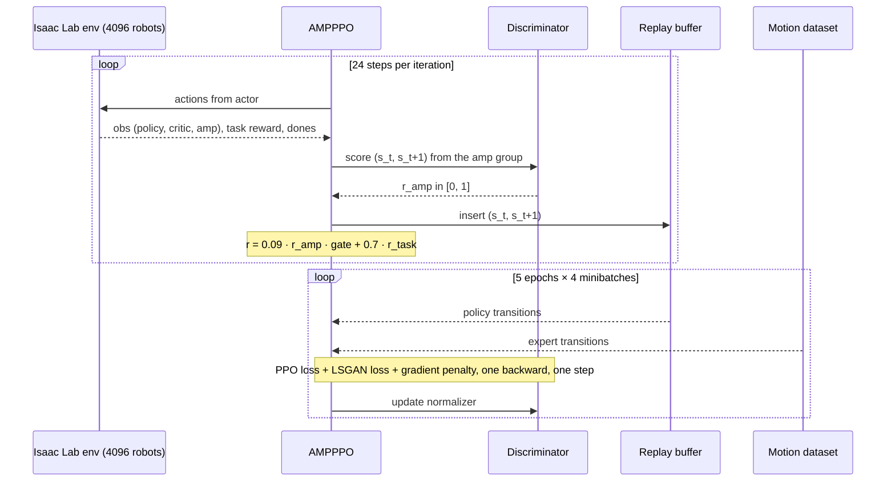

# Chapter 8 — Teaching Style with a GAN: Adversarial Motion Priors

*[← PPO for People Who Love Supervised Learning](07-ppo.md) · [Contents](README.md) · [Next: Race Day: Training and Debugging →](09-training-and-debugging.md)*

---

By the end of Chapter 5 you probably had a nagging feeling. Eighteen reward
terms. Target foot height of 10 cm. σ = 0.15 for the hip roll while walking.
A torso angular velocity weight of −0.08. Each number is someone's
hard-won judgment, and together they *still* don't fully describe what a
natural walk looks like.

You can keep adding terms forever. Or you can do what you'd do in any other
deep-learning problem where the target is "looks realistic" and is hard to
write down: **learn the loss from examples**.

That's **Adversarial Motion Priors (AMP)** (Peng et al., 2021), and it's the
reason this repo has an `algorithms/` folder at all.

## 8.1 The idea in one paragraph

Train a small classifier, the **discriminator**, to tell apart two kinds of
motion snippets: snippets from a reference **motion clip** ("expert") and
snippets produced by the **policy**. Then give the policy an extra reward for
producing snippets the discriminator thinks are expert. As the policy gets
better at fooling it, the discriminator gets better at telling them apart,
and around it goes. At equilibrium, the policy's motion *style* matches the
clip's, while the task rewards still decide *what* it does (walk at the
commanded velocity).

> 🚗 **Driving Déjà Vu**
> If you've ever trained a GAN for sensor simulation (say, making synthetic
> camera images look real), this is the same game. The table below is
> the whole chapter in miniature.

| GAN for images | AMP for locomotion |
|----------------|--------------------|
| Generator | The walking policy (plus the physics simulator!) |
| Real images | Transitions `(s_t, s_{t+1})` from the motion clip |
| Fake images | Transitions `(s_t, s_{t+1})` from the policy's rollouts |
| Discriminator loss | Least-squares GAN loss + gradient penalty |
| Generator loss | *Not a loss*: the discriminator's output becomes an **RL reward** |
| Why RL? | The physics simulator isn't differentiable, so gradients can't flow from the discriminator back into the policy. The reward bridges the gap. |

That last row is the crucial difference. In an image GAN, the generator gets
gradients through the discriminator. Here, the "generator" is a policy acting
through a physics engine, and you can't backpropagate through PhysX. So the
discriminator's opinion is turned into a reward, and PPO does the rest.

## 8.2 The expert: one motion clip

```python
# tasks/locomotion/amp_env_cfg.py
_MOTIONS_DIR = Path(__file__).resolve().parent / "motions"
ASIMOV_1_MOTION_FILES = [
    str(_MOTIONS_DIR / "policy_delay_walk_slow.npz"),
]
```

A single 4.9 MB NumPy archive. Here's what's inside (inspected directly):

| Key | Shape | Content |
|-----|-------|---------|
| `fps` | `(1,)` | `50.0`: matches the 50 Hz policy rate |
| `joint_pos` | `(2472, 23)` | Joint angles per frame (absolute, not relative) |
| `joint_vel` | `(2472, 23)` | Joint velocities |
| `body_pos_w` | `(2472, 26, 3)` | World positions of 26 bodies |
| `body_quat_w` | `(2472, 26, 4)` | World orientations (`body_quat_w_format` = `wxyz`) |
| `body_lin_vel_w`, `body_ang_vel_w` | `(2472, 26, 3)` | Body velocities |
| `joint_names` | `(23,)` | Same names as `ASIMOV_1_JOINT_NAMES` |
| `body_names` | `(26,)` | `pelvis_link`, 6 per leg, `waist_yaw_link`, 2 neck links, 5 per arm |
| `root_pos`, `root_rot`, `dof_pos`, `local_body_pos`, `link_body_list` | various | Extra fields not used by the loader |

Some quick facts computed from the clip:

- **Length:** 2,472 frames at 50 fps = **49.4 seconds** of motion.
- **Pelvis speed:** about **0.36 m/s** on average, 0.51 m/s at most. A slow
  walk, as the name says.
- **Path:** the pelvis travels from about (0, 0) to (10.1, 7.9) meters: a
  walk with turns, not a treadmill.
- **Pelvis height:** about 0.62 m, a little lower than the 0.639 m spawn
  height (the robot settles into its crouch).

> 🔧 **Under the Hood: where did this clip come from?**
> The file name, `policy_delay_walk_slow`, strongly suggests it was recorded
> from an earlier *policy* (probably one trained with actuator delay) walking
> slowly, not from human motion capture. The repo doesn't document this, so
> treat it as an inference. If true, it's an elegant bootstrapping trick:
> hand-tune one good gait with rewards, record it, and then use AMP to pull
> future policies toward that gait's style while they learn the full range of
> commands. Human mocap retargeted to the robot is the other common source
> (the README credits `whole_body_tracking` and `beyondAMP`, which work with
> such data).

## 8.3 What the discriminator sees: the `amp` observation group

```python
# tasks/locomotion/amp_env_cfg.py
_AMP_JOINTS_CFG = SceneEntityCfg("robot", joint_names=list(ASIMOV_1_JOINT_NAMES), preserve_order=True)

ASIMOV_1_AMP_OBS_TERMS = ["joint_pos", "joint_vel"]

@configclass
class AmpObsCfg(ObsGroup):
    joint_pos = ObsTerm(func=mdp.joint_pos_rel, params={"asset_cfg": _AMP_JOINTS_CFG})
    joint_vel = ObsTerm(func=mdp.joint_vel_rel, params={"asset_cfg": _AMP_JOINTS_CFG})

    def __post_init__(self):
        self.enable_corruption = False
        self.concatenate_terms = True
        term_names = [name for name, value in self.__dict__.items() if isinstance(value, ObsTerm)]
        assert term_names == ASIMOV_1_AMP_OBS_TERMS, (
            f"AMP obs group terms {term_names} drifted from ASIMOV_1_AMP_OBS_TERMS "
            f"{ASIMOV_1_AMP_OBS_TERMS}; the discriminator's policy and expert features "
            "would be misaligned."
        )

@configclass
class Asimov1AmpEnvCfg(Asimov1VelocityEnvCfg):
    def __post_init__(self):
        super().__post_init__()
        self.observations.amp = AmpObsCfg()
```

The AMP environment is just the velocity environment plus a third
observation group, `amp`: **23 joint positions (relative to default) + 23 joint
velocities = 46 numbers**, in `ASIMOV_1_JOINT_NAMES` order, with no noise and
no scaling.

The discriminator looks at **transitions**: two consecutive frames,
`(s_t, s_{t+1})`, concatenated into **92 numbers**. Why pairs? A single frame
tells you the pose; a pair tells you how the pose is *changing*. Style lives
in motion, not in snapshots.

And look at that `assert`. It's a small thing that encodes a big lesson. The
policy's AMP features come from this observation group. The expert's AMP
features come from the motion dataset, using the list
`ASIMOV_1_AMP_OBS_TERMS` to decide which properties to read. If someone adds a
term to one and not the other, the discriminator compares apples to
oranges and training silently degrades. The assert turns a silent bug into a
loud crash at startup.

> 🚗 **Driving Déjà Vu**
> This is a **feature-schema check**, like validating that your model's input
> channels match the preprocessing pipeline's output channels. You've
> probably been burned by a silent channel-order mismatch between training and
> serving. Same bug class; same fix: assert it.

Notice too what the AMP features *don't* include: no root velocity, no body
positions, no orientation. The discriminator only judges *joint-space*
style: how the legs and arms move. The task rewards handle where the body
goes. (The dataset class supports richer features, as we'll see; this config
just doesn't use them.)

## 8.4 Loading the expert: `MotionDataset`

`tasks/locomotion/motion_dataset.py` turns the `.npz` into GPU tensors the
discriminator can sample from. It's configured by:

```python
# agents/rsl_rl_ppo_cfg.py
amp_data=MotionDatasetCfg(
    motion_files=ASIMOV_1_MOTION_FILES,
    joint_names=list(ASIMOV_1_JOINT_NAMES),
    body_names=list(ASIMOV_1_KEY_BODY_NAMES),   # both feet, both wrists, waist
    amp_obs_terms=list(ASIMOV_1_AMP_OBS_TERMS), # ["joint_pos", "joint_vel"]
    anchor_name=ASIMOV_1_ANCHOR_NAME,           # "pelvis_link"
),
```

The important parts of `load_motions`, simplified:

```python
# The joint offset: the TRUE (unrandomized) default pose, in cfg joint order.
sel_ids = self.robot.find_joints(self.joint_names, preserve_order=True)[0]
default_joint_pos = getattr(self.robot.data, "nominal_default_joint_pos", None)
if default_joint_pos is None:
    default_joint_pos = self.robot.data.default_joint_pos
joint_pos_offset = default_joint_pos[0, sel_ids].detach().cpu().numpy()

for f in self.motion_files:
    data = np.load(f)
    # ... validate body_names (all clips must share one ordering) ...
    # ... validate fps is a scalar ...
    file_joint_names = [str(n) for n in data["joint_names"]]
    joint_ids = [file_joint_names.index(name) for name in self.joint_names]  # reorder
    joint_pos = data["joint_pos"][:, joint_ids] - joint_pos_offset           # make relative
    joint_vel = data["joint_vel"][:, joint_ids]
    ...
```

Three careful design choices:

1. **Reordering by name.** The file's joint order doesn't have to match the
   config's. The loader looks up each configured joint by name and
   reorders. Missing joints raise a clear `ValueError`.
2. **Relative to the nominal default.** The clip stores absolute angles; the
   policy observes angles relative to the default. The loader subtracts
   the default, and specifically the `nominal_default_joint_pos` saved by the
   `qpos0_rand` event *before* it perturbed anything (Chapter 6). Otherwise
   the expert data would inherit robot #0's random calibration offset.
3. **Validation everywhere.** Missing files, missing bodies, mismatched body
   orderings across clips, non-scalar `fps`: all raise with a readable
   message.

### Transitions never cross clip boundaries

With multiple clips concatenated into one tensor, a naive `(t, t+1)` pairing
would create fake transitions from the last frame of clip A to the first
frame of clip B. `_build_transition_indices` avoids that:

```python
def _build_transition_indices(self, traj_lengths, device):
    idx_t, idx_tp1 = [], []
    offset = 0
    for length in traj_lengths:
        if length < 2:
            offset += length
            continue
        t = torch.arange(offset, offset + length - 1)
        idx_t.append(t)
        idx_tp1.append(t + 1)
        offset += length
    return torch.cat(idx_t).to(device), torch.cat(idx_tp1).to(device)
```

For our single clip: 2,471 valid transitions.

### Sampling

```python
def feed_forward_generator(self, num_mini_batch, mini_batch_size):
    for _ in range(num_mini_batch):
        t, tp1 = self.sample_batch(mini_batch_size)      # uniform, with replacement
        state_features, next_state_features = [], []
        for term in self.observation_terms:              # ["joint_pos", "joint_vel"]
            data = getattr(self, term)
            state_features.append(data[t])
            next_state_features.append(data[tp1])
        yield torch.cat(state_features, dim=-1), torch.cat(next_state_features, dim=-1)
```

`getattr(self, term)` is how the observation-term *names* become data. The
dataset exposes many properties: `joint_pos`, `joint_vel`, and also body
positions, orientations and velocities in the world frame (`body_pos_w`, ...)
or relative to the pelvis anchor (`body_pos_b`, `body_quat_b`,
`body_lin_vel_b`, `body_ang_vel_b`), plus `anchor_height`, `base_lin_vel`
and `base_ang_vel`. To give the discriminator richer features, you'd add
names to `ASIMOV_1_AMP_OBS_TERMS` *and* matching terms to `AmpObsCfg`. The
assert and the dimension check will make sure you did both.

`init_observation_dims` sums each term's last dimension to get
`observation_dim` (46 here), which `AMPPPO.construct_algorithm` compares
against the environment's actual `amp` group size.

## 8.5 The discriminator

`algorithms/discriminator.py`:

```python
class AMPDiscriminator(nn.Module):
    def __init__(self, observation_dim, hidden_dims=(256, 256), activation="relu",
                 feature_normalization=True, device="cpu"):
        super().__init__()
        self.input_dim = 2 * observation_dim            # (s_t, s_t+1) → 92
        layers = []
        current_dim = self.input_dim
        for hidden_dim in hidden_dims:
            layers.append(nn.Linear(current_dim, hidden_dim))
            layers.append(resolve_nn_activation(activation))
            current_dim = hidden_dim
        self.trunk = nn.Sequential(*layers)            # 92 → 256 → 256
        self.linear = nn.Linear(current_dim, 1)         # 256 → 1 (the "head")
        if feature_normalization:
            self.feature_norm = AMPFeatureNormalizer(observation_dim)

    def forward(self, transition):
        return self.linear(self.trunk(transition))
```

A plain MLP: 92 → 256 → 256 → 1 with ReLU. Tiny compared with the policy's
workload, and it doesn't need to be big: it only has to separate two
distributions of 92-d vectors.

### The loss: least-squares GAN

In `AMPPPO._joint_update`:

```python
policy_d = self.discriminator(torch.cat((norm_policy_state, norm_policy_next_state), dim=-1))
expert_d = self.discriminator(torch.cat((norm_expert_state, norm_expert_next_state), dim=-1))
expert_loss = nn.functional.mse_loss(expert_d, torch.ones_like(expert_d))    # expert → +1
policy_loss = nn.functional.mse_loss(policy_d, -torch.ones_like(policy_d))   # policy → −1
amp_loss = 0.5 * (expert_loss + policy_loss)
```

Instead of the classic binary cross-entropy, it's a **least-squares
regression**: push expert outputs toward +1 and policy outputs toward −1. That's
the LSGAN formulation used in the original AMP paper. Its advantage: it doesn't
saturate. A sigmoid-cross-entropy discriminator that becomes very confident
gives near-zero gradients (and near-constant rewards); a least-squares one
keeps giving informative outputs.

### From discriminator output to reward

```python
@torch.no_grad()
def predict_amp_reward(self, state, next_state):
    self.eval()
    normalized_state = self.normalize(state)
    normalized_next_state = self.normalize(next_state)
    prediction = self(torch.cat((normalized_state, normalized_next_state), dim=-1))
    reward = torch.clamp(1.0 - 0.25 * torch.square(prediction - 1.0), min=0.0)
    self.train()
    return reward.squeeze(-1), prediction.squeeze(-1)
```

```
r_amp = max(0, 1 − ¼ · (d − 1)²)
```

Plot it in your head:

| Discriminator output `d` | Meaning | `r_amp` |
|---:|---|---:|
| +1 | "Definitely expert" | **1.0** |
| 0 | "Can't tell" | 0.75 |
| −1 | "Definitely policy" | **0.0** |
| < −1 | Even more confident "policy" | 0 (clamped) |

A smooth, bounded reward in [0, 1] that's highest when the transition looks
like the clip.

### The gradient penalty

```python
def compute_grad_pen(self, expert_state, expert_next_state, lambda_=10.0):
    expert_transition = torch.cat((expert_state, expert_next_state), dim=-1).detach().requires_grad_(True)
    prediction = self(expert_transition)
    gradient = autograd.grad(outputs=prediction, inputs=expert_transition,
                             grad_outputs=torch.ones_like(prediction),
                             create_graph=True, retain_graph=True, only_inputs=True)[0]
    return lambda_ * gradient.norm(2, dim=1).pow(2).mean()
```

```
L_gp = λ · E_expert[ ‖∇_x D(x)‖² ],    λ = 10
```

This penalizes the discriminator for having steep gradients *around expert
data*. Without it, the discriminator can become arbitrarily sharp: a cliff
right at the edge of the expert distribution. Then the policy gets 0 reward
until it's almost perfect, and nothing to climb along. The penalty keeps
the discriminator's landscape smooth, so the reward rises gradually as the
policy's motion gets closer to expert motion. In GAN-land, this is what keeps
training from collapsing.

> 🔧 **Under the Hood: raw vs normalized inputs**
> Look closely: the classification loss runs the discriminator on
> **normalized** features, but `compute_grad_pen` is called with the **raw**
> expert features (`expert_state`, not `normalized_expert_state`). The
> unit test `test_discriminator_reward_and_raw_gradient_penalty_match_baseline_formulas`
> pins this behavior on purpose ("raw gradient penalty"), matching the
> reference implementation the code was ported from. It's a good example of
> a choice you might "fix" on a whim and thereby change results. When porting
> research code, first reproduce, *then* improve.

### Weight decay on the discriminator

```python
self.optimizer.add_param_group({"params": self.discriminator.trunk.parameters(),
                                "weight_decay": amp_discr_trunk_weight_decay,   # 1e-3
                                "name": "amp_trunk"})
self.optimizer.add_param_group({"params": self.discriminator.linear.parameters(),
                                "weight_decay": amp_discr_head_weight_decay,    # 1e-1
                                "name": "amp_head"})
```

The discriminator's parameters join PPO's Adam optimizer as two extra
parameter groups, with weight decay. The **head** gets 100× more decay than
the trunk. Keeping the final layer's weights small keeps the outputs
(and therefore the rewards) from becoming extreme. It's another smoothness
regularizer, complementing the gradient penalty.

## 8.6 The feature normalizer

```python
class AMPFeatureNormalizer(nn.Module):
    def __init__(self, observation_dim, epsilon=1.0e-4, clip_obs=10.0):
        ...
        self.register_buffer("_mean", torch.zeros(1, observation_dim, dtype=torch.float64))
        self.register_buffer("_var", torch.ones(1, observation_dim, dtype=torch.float64))
        self.register_buffer("_std", torch.ones(1, observation_dim, dtype=torch.float64))
        self.register_buffer("count", torch.tensor(1.0e-4, dtype=torch.float64))

    def forward(self, values):
        mean = self._mean.to(device=values.device, dtype=values.dtype)
        variance = self._var.to(device=values.device, dtype=values.dtype)
        normalized = (values - mean) / torch.sqrt(variance + self.epsilon)
        return torch.clamp(normalized, -self.clip_obs, self.clip_obs)
```

Joint positions are in radians (~0.1 to 1); joint velocities in rad/s (up to
7.6 in the clip, for the knees). Without normalization, velocities would
dominate the discriminator's inputs. The normalizer keeps a running mean and
variance per feature and standardizes inputs, clipped to ±10.

The update uses the parallel variance-combination formula (Chan et al.),
computed in float64 NumPy for precision:

```python
delta = batch_mean - mean
total_count = count + batch_count
new_mean = mean + delta * batch_count / total_count
moment_2 = var * count + batch_var * batch_count + delta² * count * batch_count / total_count
new_var = moment_2 / total_count
```

The statistics are buffers (`register_buffer`), so they're saved in the
discriminator's `state_dict` and restored with checkpoints.

After each optimizer step, both the policy's and the expert's features update
the statistics:

```python
@torch.no_grad()
def update_normalization(self, policy_state, expert_state):
    if not self.feature_normalization:
        return
    normalized_policy_state = self.normalize(policy_state)
    normalized_expert_state = self.normalize(expert_state)
    self.feature_norm.update(normalized_policy_state)
    self.feature_norm.update(normalized_expert_state)
```

> 🔧 **Under the Hood: a curious detail**
> Notice that the statistics are updated with **already-normalized** values,
> not raw ones. That's unusual; a standard running normalizer tracks raw
> statistics. The test
> `test_feature_normalizer_matches_baseline_numpy_equations` feeds normalized
> batches to `update` and checks the result against hand-computed NumPy,
> which shows this is a *deliberate* reproduction of a baseline's behavior,
> not an accident. It's a nice exercise to work out what these statistics
> converge to. (Hint: think about what happens once the normalized values
> have zero mean and unit variance.)

## 8.7 The policy's side: the replay buffer

The expert data is fixed. The policy's data is fresh each iteration. The
discriminator trains on policy transitions stored in `AMPReplayBuffer`
(`algorithms/replay_buffer.py`): a GPU ring buffer of `(state, next_state)`
pairs.

```python
class AMPReplayBuffer:
    def __init__(self, observation_dim, capacity, device):
        self.states = torch.empty(capacity, observation_dim, device=device)
        self.next_states = torch.empty(capacity, observation_dim, device=device)
        self.capacity = capacity
        self._cursor = 0
        self.num_samples = 0

    @torch.no_grad()
    def insert(self, states, next_states):
        ...
        if len(states) >= self.capacity:          # batch bigger than the buffer:
            self.states.copy_(states[-self.capacity:])   # keep only the newest
            ...
            return
        end = self._cursor + len(states)
        if end <= self.capacity:                  # fits without wrapping
            self.states[self._cursor:end].copy_(states)
            ...
        else:                                     # wraps around the end
            first_count = self.capacity - self._cursor
            self.states[self._cursor:].copy_(states[:first_count])
            self.states[:end - self.capacity].copy_(states[first_count:])
            ...
        self._cursor = end % self.capacity
        self.num_samples = min(self.capacity, self.num_samples + len(states))

    def generator(self, num_batches, batch_size):
        for _ in range(num_batches):
            indices = np.random.choice(self.num_samples, size=batch_size)
            yield self.states[indices], self.next_states[indices]
```

The one invariant that matters: **`states[i]` and `next_states[i]` must stay
paired**, even across wraparound. `test_replay_buffer_keeps_state_pairs_aligned_across_wraparound`
inserts 3 then 4 pairs into a buffer of capacity 5 (forcing a wrap) and checks
that every stored and sampled `next_state` still equals its `state + 100`.

Capacity is `amp_replay_buffer_size = 100_000`. Each PPO iteration inserts
4,096 × 24 = 98,304 transitions, so the buffer holds roughly **the last
iteration's worth** of policy data (plus a sliver of the one before). In
practice, the discriminator is trained on very recent policy behavior. If you
wanted it to remember older mistakes (a common trick to stabilize GANs), you'd
increase the capacity.

## 8.8 Wiring it into PPO: `AMPPPO`

`algorithms/amp_ppo.py` subclasses RSL‑RL's `PPO`. It overrides three moments
in the training loop.

### Moment 1: construction

RSL‑RL builds the algorithm from the config via
`construct_algorithm`. `AMPPPO` intercepts that to build the dataset and check
dimensions first:

```python
@staticmethod
def construct_algorithm(obs, env, cfg, device):
    alg_cfg = cfg["algorithm"]
    amp_data_cfg = dict(alg_cfg.pop("amp_data"))
    dataset_class = resolve_callable(amp_data_cfg.pop("class_type"))
    amp_data = dataset_class(env=env.unwrapped, device=device, **amp_data_cfg)

    amp_obs_key = alg_cfg.get("amp_obs_key", "amp")
    if amp_obs_key not in obs.keys():
        raise ValueError(...)            # the env has no "amp" group
    amp_obs_dim = obs[amp_obs_key].shape[-1]
    if amp_obs_dim != amp_data.observation_dim:
        raise ValueError(...)            # env features ≠ dataset features

    alg_cfg["amp_observation_dim"] = amp_obs_dim
    alg_cfg["amp_data"] = amp_data
    alg_cfg["command_manager"] = getattr(env.unwrapped, "command_manager", None)
    return PPO.construct_algorithm(obs, env, cfg, device)
```

And how does RSL‑RL know to use `AMPPPO` at all? Through one config line:

```python
@configclass
class AMPPPOAlgorithmCfg(RslRlPpoAlgorithmCfg):
    class_name: str = "isaac_asimov.algorithms.amp_ppo:AMPPPO"
    ...
```

RSL‑RL 5 resolves `class_name` as an import path. That's why the repo needs
**no custom runner**: the standard `OnPolicyRunner` builds whatever algorithm
class the config names. (The test `test_amp_ppo_pairs_frames_and_blends_rewards_without_custom_runner`
is named after exactly this property.)

### Moment 2: every environment step

```python
def process_env_step(self, obs, rewards, dones, extras):
    amp_state = self.transition.observations[self.amp_obs_key]     # s_t (stored by act())
    amp_next_state = obs[self.amp_obs_key]                          # s_{t+1}
    if self.amp_rollout_obs_clip is not None:
        done_mask = dones.bool()
        if torch.any(done_mask):
            amp_next_state = amp_next_state.clone()
            amp_next_state[done_mask] = amp_next_state[done_mask].clamp(-500, 500)
    amp_rewards, discriminator_predictions = self.discriminator.predict_amp_reward(amp_state, amp_next_state)
    amp_rewards = self.amp_reward_coef * amp_rewards               # × 0.3
    gate = self._amp_command_gate()
    self.amp_storage.insert(amp_state, amp_next_state)             # → replay buffer
    if gate is not None:
        amp_rewards = amp_rewards * gate
    total_rewards = (1.0 - self.amp_task_reward_lerp) * amp_rewards + self.amp_task_reward_lerp * rewards

    log = extras.setdefault("log", {})
    log["Train/mean_amp_reward"] = amp_rewards.mean()
    log["Train/mean_task_reward"] = rewards.mean()
    log["Train/mean_discriminator_prediction"] = discriminator_predictions.mean()

    self._clip_rollout_observations(obs)
    super().process_env_step(obs, total_rewards, dones, extras)
```

Step by step:

1. **Pair the frames.** `self.transition.observations` holds the observation
   from which the current action was chosen (saved by `act()`). `obs` is what
   came back from `env.step`. Together they form `(s_t, s_{t+1})`.
2. **Score them.** The discriminator's reward, times `amp_reward_coef = 0.3`.
3. **Gate by command.** With `amp_reward_command_gate=True`, threshold 0.1:

   ```python
   command_norm = torch.linalg.norm(command[:, :3], dim=1)   # ‖[vx, vy, ωz]‖
   gate = (command_norm > 0.1).float()
   ```

   When the robot is told to stand still, the AMP reward is zero. The clip is
   a *walking* clip; rewarding "walk-like" joint motion while standing would
   fight the standing posture terms. (Note this uses the Euclidean norm
   of all three components, a slightly different formula from the reward
   terms' `|v_xy| + |ωz|`.)
4. **Store for the discriminator.** Every policy transition goes into the
   replay buffer, gated or not.
5. **Blend.** With `amp_task_reward_lerp = 0.7`:

   ```
   r_total = 0.3 · r_amp_scaled + 0.7 · r_task
           = 0.3 · (0.3 · r_amp · gate) + 0.7 · r_task
           = 0.09 · r_amp · gate + 0.7 · r_task
   ```

   The unit test checks exactly this formula:
   `expected_reward = 0.3 * (0.3 * raw_amp_reward * gate) + 0.7 * task_reward`.
6. **Log** three diagnostics.
7. **Clip observations** for the policy and critic groups in place to
   ±500 (a guard against rare physics blow-ups producing huge values; the
   test checks that 1000 becomes 500 and −1000 becomes −500).
8. **Hand off to PPO** with the blended reward.

> 🔧 **Under the Hood: the AMP reward is bigger than it looks**
> "0.09 × r_amp" sounds tiny next to a velocity-tracking weight of 5.0. But
> remember Chapter 5: Isaac Lab multiplies task rewards by `dt = 0.02` *before*
> they reach the algorithm. So the task reward per step is at most about
> 0.24 (and 0.7 × that is ~0.17), while the AMP term can contribute up to
> 0.09 per step, since it's computed *here*, in the algorithm, with no `dt`
> factor. The style reward is a first-class citizen, not a garnish. If you ever
> change `decimation` or `sim.dt`, the balance between AMP and task rewards
> shifts, because only one side scales with `dt`.

> 🔧 **Under the Hood: episode boundaries**
> When an environment resets, `obs` holds the *post-reset* observation. So
> the pair `(s_t, s_{t+1})` for that environment straddles two episodes. The
> code clips that `next_state` but otherwise scores it and stores it like any
> other. Such transitions are clearly non-expert, and they're rare (a
> fraction of a percent of samples), so the effect is small. But it's a good
> example of the kind of detail worth checking when you adapt this code.

### Moment 3: the update

`update()` calls `_joint_update()`, which is RSL‑RL's PPO update loop plus
AMP. For each of the 20 minibatches:

```python
if train_amp:
    policy_state, policy_next_state = next(policy_generator)    # from the replay buffer
    expert_state, expert_next_state = next(expert_generator)    # from the motion dataset
    ... normalize, run discriminator, LSGAN loss ...
    grad_pen = self.discriminator.compute_grad_pen(expert_state, expert_next_state, lambda_=10.0)
    loss += amp_loss + grad_pen

self.optimizer.zero_grad()
loss.backward()                       # ONE backward pass for actor, critic AND discriminator
...
self._clip_actor_critic_gradients()   # clips actor+critic only
self.optimizer.step()                 # ONE step, all parameter groups
self._clamp_action_std()
...
if train_amp:
    self.discriminator.update_normalization(policy_state, expert_state)
```

Key facts:

- **One loss, one backward, one optimizer step.** The PPO loss and the
  discriminator loss are summed. Since they share no parameters, summing them
  is equivalent to training separately, just in one pass.
- **AMP minibatch size = PPO minibatch size** (24,576). The expert generator
  samples 24,576 transitions (with replacement) from only 2,471 unique ones,
  so every expert transition is seen about 10 times per minibatch.
- **`amp_update_interval = 1`**: the discriminator trains every
  iteration. Raise it to train the discriminator less often if it
  overpowers the policy.
- **The KL-adaptive learning rate applies to the discriminator too**
  (Chapter 7), because it shares the optimizer.
- **`_clamp_action_std`** clamps the policy's std parameter to be ≥
  `amp_min_normalized_std` (0.0), which just keeps it non-negative.

Returned losses include `amp`, `amp_grad_pen`, `amp_policy_pred` and
`amp_expert_pred`. The last two are gold for debugging (Chapter 9).

### Multi-GPU and checkpoints

For distributed training, `AMPPPO` extends RSL‑RL's hooks:

- `reduce_parameters` averages gradients across GPUs for the actor, critic,
  **and discriminator**.
- `_sync_discriminator_normalizer` broadcasts rank 0's normalizer statistics
  after each update, so all GPUs normalize identically.
- `broadcast_parameters` also broadcasts the discriminator's weights at
  start-up.

For checkpoints, `save()` adds `discriminator_state_dict`, and `load()`
restores it. `load()` also handles an older checkpoint layout where the
discriminator's optimizer state was saved separately
(`amp_optimizer_state_dict`), merging it into the single optimizer with
`_load_split_optimizer_states`. That's backward compatibility you'll appreciate
when resuming a months-old run.

## 8.9 The whole AMP loop, in one picture



## 8.10 AMP hyperparameters at a glance

| Parameter | Value | Role |
|-----------|-------|------|
| `amp_obs_key` | `"amp"` | Which observation group feeds the discriminator |
| `amp_reward_coef` | 0.3 | Scale on the raw discriminator reward |
| `amp_task_reward_lerp` | 0.7 | Blend: 0.7 task, 0.3 AMP |
| `amp_discr_hidden_dims` | `[256, 256]` | Discriminator MLP |
| `amp_discr_activation` | `"relu"` | |
| `amp_feature_normalization` | `True` | Running mean/var normalizer |
| `amp_grad_pen_lambda` | 10.0 | Gradient penalty strength |
| `amp_replay_buffer_size` | 100,000 | Policy transitions kept |
| `amp_discr_trunk_weight_decay` | 1e‑3 | |
| `amp_discr_head_weight_decay` | 1e‑1 | Keeps outputs (rewards) moderate |
| `amp_update_interval` | 1 | Train discriminator every iteration |
| `amp_reward_command_gate` | `True` (AMP runner) | Zero AMP reward when standing |
| `amp_reward_command_name` | `"twist"` | |
| `amp_reward_command_threshold` | 0.1 | |
| `amp_rollout_obs_clip` | 500.0 | Observation safety clip |
| `amp_min_normalized_std` | 0.0 | Lower bound on the policy std |

The AMP runner config also changes the log folder: `experiment_name =
"asimov_velocity_amp"`, `run_name = "amp"`.

## 🏁 Pit Stop

1. Why can't the discriminator's gradients flow directly into the policy, as
   in an image GAN?
2. What exactly does the discriminator look at, and how many numbers is that?
3. What reward does the policy get when the discriminator outputs 0? −1? +1?
4. What would go wrong without the gradient penalty?
5. Why does the motion dataset subtract `nominal_default_joint_pos` rather
   than `default_joint_pos`?
6. Write the final blended reward formula with this repo's numbers.
7. Why is the AMP reward gated off for standing commands?

<details>
<summary>Answers</summary>

1. The policy acts through a physics simulator that isn't differentiable. The
   discriminator's output is turned into an RL reward instead.
2. A transition: joint positions (relative to default) and joint velocities
   at two consecutive steps, `2 × (23 + 23) = 92` numbers.
3. 0.75, 0.0, 1.0 (from `max(0, 1 − ¼(d − 1)²)`).
4. The discriminator could become arbitrarily sharp around expert data,
   giving near-zero reward almost everywhere and no gradient for the policy
   to climb.
5. `default_joint_pos` has been perturbed per-robot by `qpos0_rand`; the
   expert clip should be expressed relative to the true, unperturbed default.
6. `r = 0.3 · (0.3 · r_amp · gate) + 0.7 · r_task = 0.09 · r_amp · gate + 0.7 · r_task`.
7. The clip is walking motion. Rewarding walk-like joint motion when told to
   stand would conflict with the standing posture terms.

</details>

---

*[← PPO for People Who Love Supervised Learning](07-ppo.md) · [Contents](README.md) · [Next: Race Day: Training and Debugging →](09-training-and-debugging.md)*
